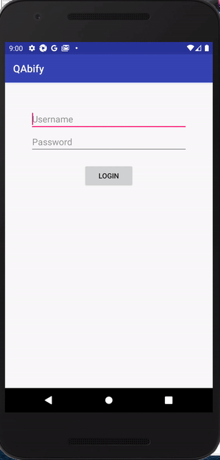

### Installing

Clone the project, run one of the following commands

```
git clone git@github.com:sarahasghedom/qabify.git #SSH
git clone https://github.com/sarahasghedom/qabify.git #HTTPS
```

Install the dependencies.

```
npm install
```
You will also need to install appium(http://appium.io/docs/en/about-appium/getting-started/). Also install android studio(https://developer.android.com/studio/install) and make sure to setup an emulator. You can specify the name of the emulator in the ```wdio.android.app.conf.js``` file

Run the test
````
npm run android.app
````


